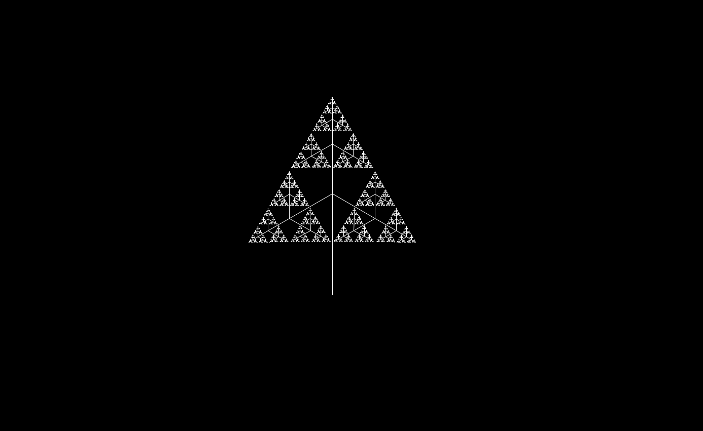
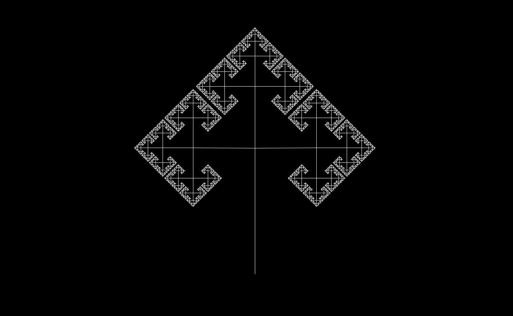
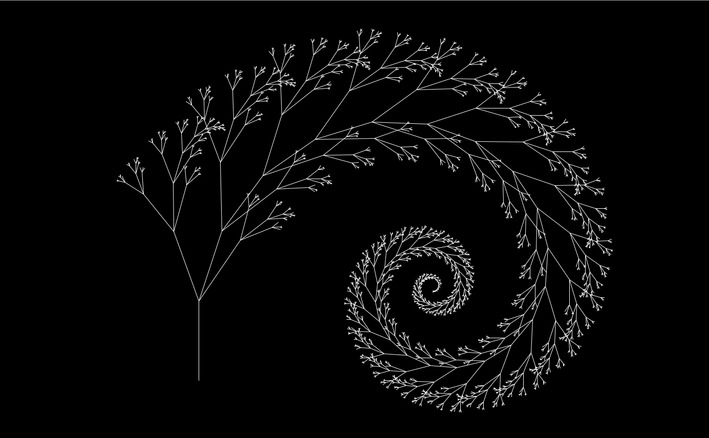
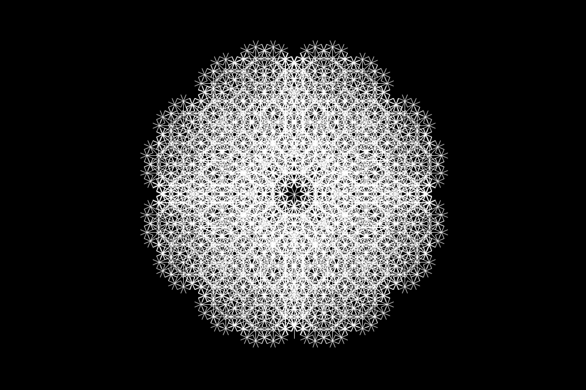
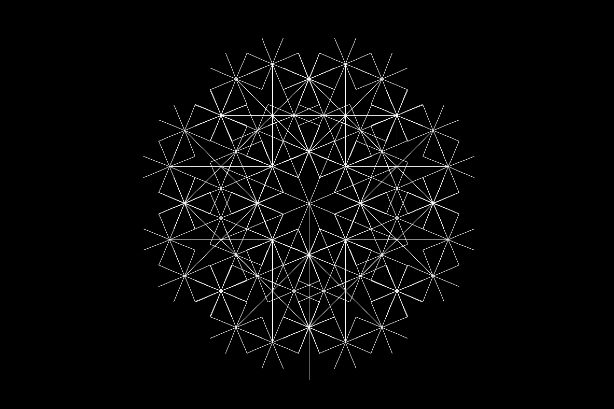
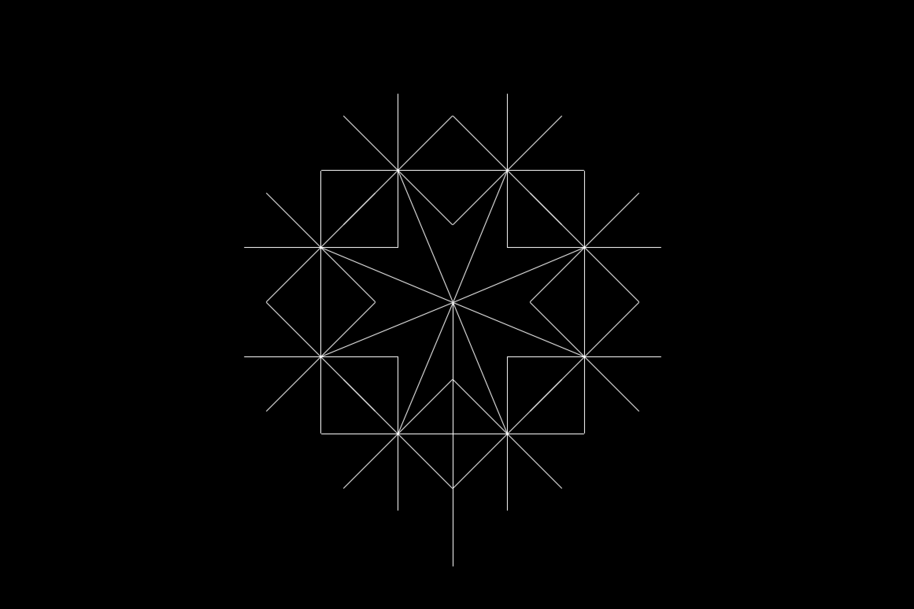
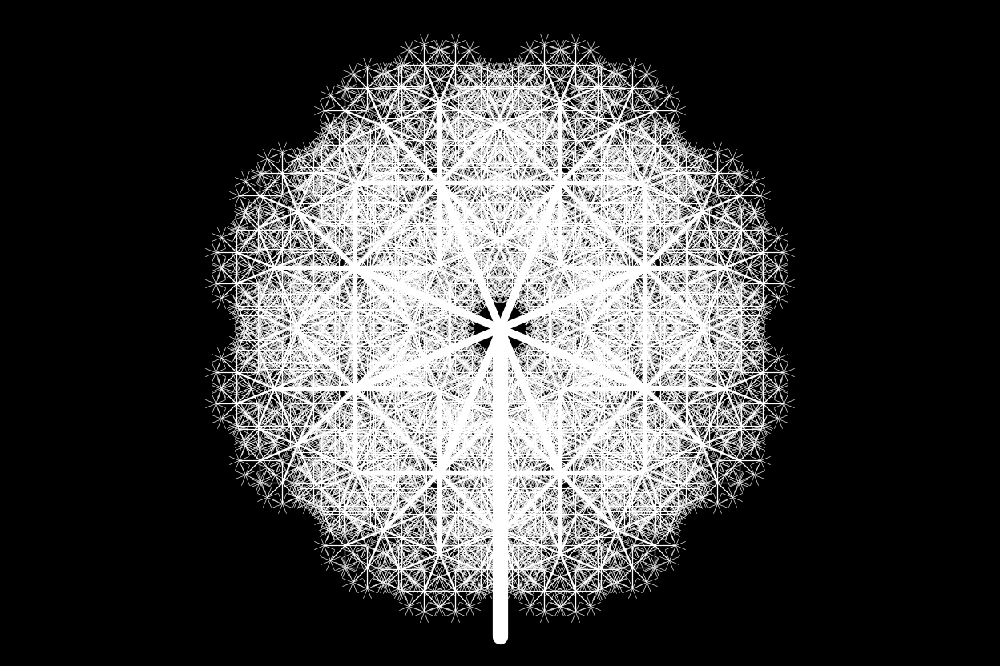
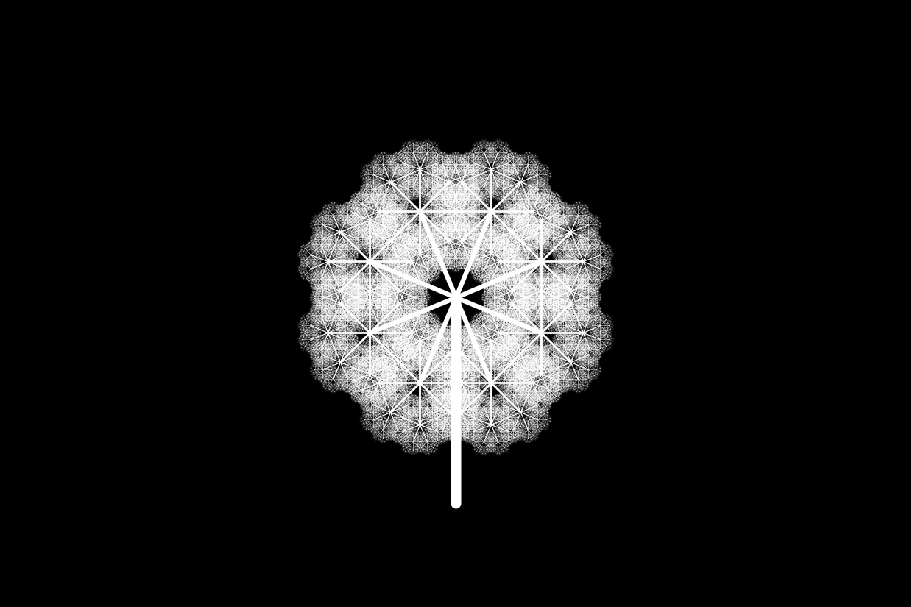
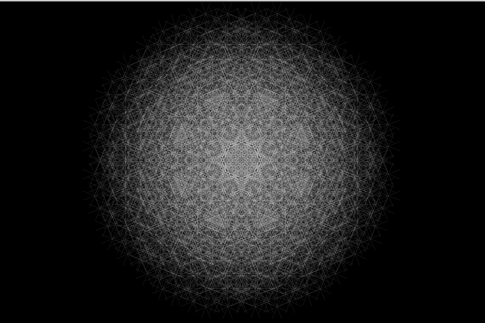
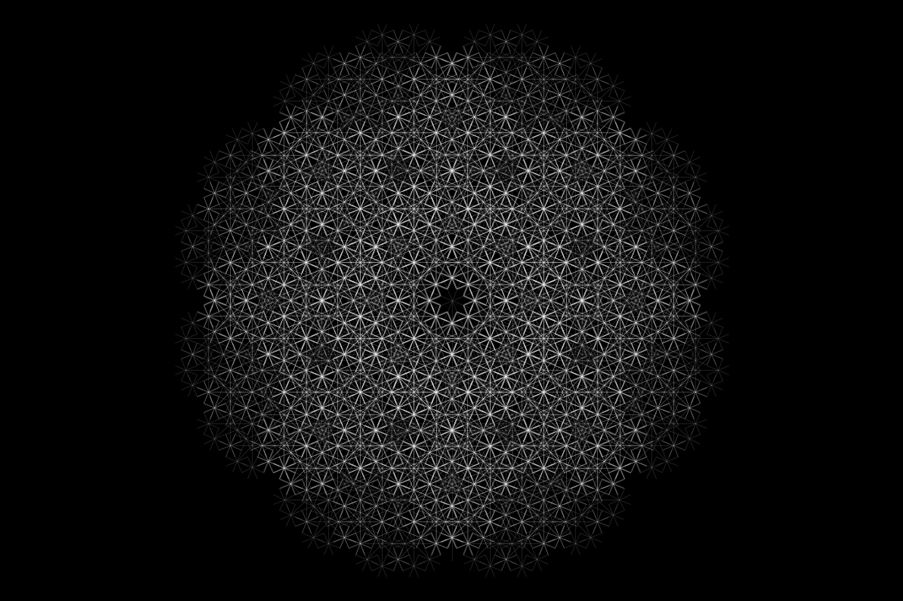

Processing codes to generate fractal trees.  

#### How to run the code:  
Install processing and run the code fractal_tree.pde

#### Commands:  
* Position of mouse: changes the origin of the tree.  
* a: decreases the angle used to create the branches.  
* z: increases the angle used to create the branches.  
* e: the length of a new branch is the length of the previous branch times a ratio. It decreases this ratio.  
* r: the length of a new branch is the length of the previous branch times a ratio. It increases this ratio.  
* t: decreases the lenght of the first branch.  
* y: increases the lenght of the first branch.  
* u: the branches are created recursively until they are attaining a certain lentgh. It decreases this length.  
* i: the branches are created recursively until they are attaining a certain lentgh. It increases this length.  

#### Gallery of pictures obtained with the code  

Obtained with version 1:  

Obtained with version 2:  

Obtained with version 3:  

Obtained with version 4:  

Obtained with version 5:  

Obtained with version 6:  

